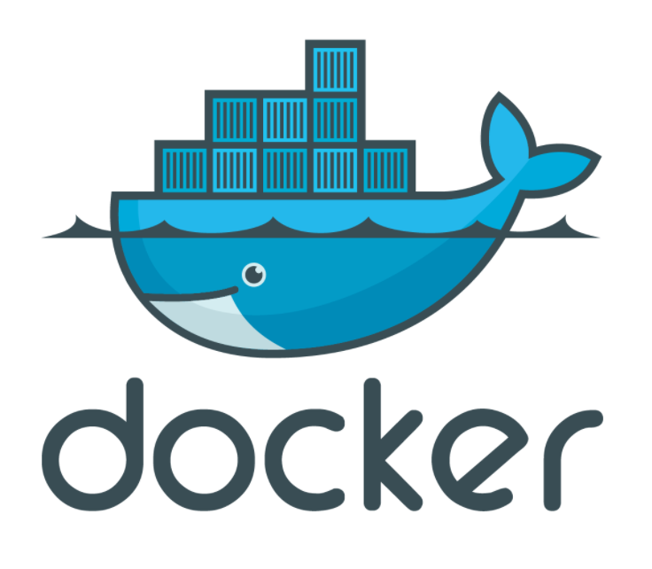
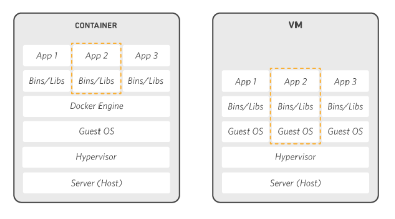
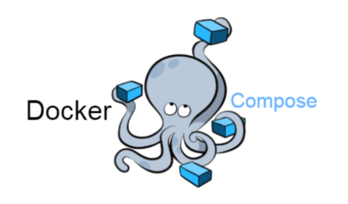

# Docker-Container
docker와 컨테이너의 기본 개념 및 코드 정리!
<hr/>


<hr />

### Docker란?
  1) Docker는 컨테이너를 활용하여 다수의 프로그램을 실핼할 수 있는 플랫폼이다. Docker라는 가상화 플랫폼 아래에 다수의 컨테이너가 존재한다. 이를 활용하여 여러개의 Container를 자유롭게 사용하여 수많은 기능을 쓸수있다.
  
    - 응용 프로그램을 격리된 컨테이너 단위로 관리하여 인프라 의존성에 대한 걱정없이 실행, 제거 가능
    - Docker를 사용하는 기본방법
      + Docker를 설치하고 image파일을 준비
      + 준비된 이미지 파일로 자신이 원하는 Container 생성

  2) Container 기반의 오픈소스 가상화 플랫폼
      - Container란?
        + 운영체제 수준의 가상화 기술로 리눅스 커널을 공유하면서 프로세스를 격리된 환경에서 실행하는 기술
        + 실행 속도가 빠르고, 성능 상의 손실이 거의 없음
        
      - [기상화란?]
        + 기존의 가상화 기술은 하이퍼바이저라고 하는 소프트웨어를 사용하여 하나의 물리적 머신에 다수의 가상 머신을 만드는 기술
        + Docker에서 사용하는 컨테이너는 리눅스 자체기능을 이용해서 프로세스 단위의 격리된 환경 구현 -> 성능 손실 거의 없음
<hr />

  3) 도커의 구조
      - 도커를 설치하고 실행하면 DOCKERD라는 데몬 프로그램이 서버로서 실행
      - REST API, CLI 등의 도구들이 클라이언트가 되어서 도커 데몬에게 작업을 지시
<hr />

  4) 도커의 아키텍처
      - 도커 데몬
        + 도커 API 요청을 수신하고 이미지, 컨테이너, 네트워크 및 볼륨과 같은 도커 객체를 관리
        + 도커 서비스를 관리하기 위해 다른 데몬과 통신 가능
      - 도커 클라이언트
        + Docker와 상호 작용하는 방법
        + Docker 클라이언트는 둘 이상의 데몬과 통신 가능
      - 도커 레지스트리
        + 도커 이미지를 저장
      - 도커 오브젝트
        + 도커 이미지
            * 도커 컨테이너를 만들기 위한(실행하기 위한) 읽기 전용 템플릿
        + 도커 컨테이너
            * 도커 이미지의 실행가능한 인스턴스
            * 컨테이너를 생성하게 되면 해당 이미지에서 정의한 파일 시스템과 파일, 그리고 격리된 시스템 자원 및 네트워크를 사용할 수 있는 독립된 공간이 생성
<hr />

###  Docker 설치 방법
1) `sudo apt-get remove docker docker-engine docker.io containerd runc`
2) `sudo apt-get update`
3) `sudo apt-get install \ apt-transport-https \ ca-certificates \ curl \ gnupg-agent \ software-properties-common`
4) `curl -fsSL https://download.docker.com/linux/ubuntu/gpg | sudo apt-key add -`
5) `sudo apt-key fingerprint 0EBFCD88`
6) `sudo add-apt-repository \ "deb [arch=amd64] https://download.docker.com/linux/ubuntu \ $(lsb_release -cs) \ stable`
7) `sudo apt-get update`
8) `sudo apt-get install docker-ce docker-ce-cli containerd.io`
9) `apt-cache madison docker-ce`
10) `sudo apt-get install docker-ce=<VERSION_STRING> docker-ce-cli=<VERSION_STRING> containerd.io`
11) `sudo docker run hello-world`

- 도커 설치부터 실행까지!
    + 11번에 있는 hello-world는 ubuntu와 다른 이미지
<hr />

### 도커 실행 명령문
- 도커 컨테이너 추가하기 1
`docker run -i -t --name se01 ubuntu /bin/bash`
  + se라는 ubuntu 컨테이너가 생성됨!

- 추가된 컨테이너에 접속하는 방법 
`docker attach se01`

- 컨테이너에 접속한 이후에 종료하기 위해서는 `exit` 타이핑!
    + attach로 접속한 컨테이너는 한번 `exit`로 나가면 다시 재접속할때 컨테이너를 재실행해야함

- 도커 컨테이너 추가하기 2
`docker run -i -t -d --name se01 ubuntu /bin/bash`

- se라는 ubuntu 컨테이너가 생성됨!

- 추가된 컨테이너에 접속하는 방법 
`docker attach se01`

- 컨테이너에 접속한 이후에 종료하기 위해서는 exit 타이핑!
    + `-d` 옵션을 활용하여 `exit`를 통해서 외부로 나가도 백그라운드에서 계속 실행 상태를 유지

- 컨테이너 중지하기
`sudo docker stop se01`

- 컨테이너 재부팅하기
`sudo docker restart se01`

- 전체 컨테이너 확인하기
`sudo docker ps -a`

- 실행중인 컨테이너 확인하기
`sudo docker ps`

- 컨테이너 삭제하기
`sudo docker rm se01`

- 이미지 삭제하기
`docker rmi ubuntu:latest`

- 도커 버전 확인
`sudo docker version`

- 도커 실행환경 확인
`sudo docker system info`

- 도커 컨테이너 상세 정보
`sudo docker inspect`

- 도커에 저장된 이미지 목록 확인
`sudo docker images`

- 이미지 다운로드
`sudo docker pull ubuntu:14.04`

- 도커와 호스트간의 공유 폴더 생성
  + 이미지를 생설할때부터 공유 폴더 지정
    `docker run -i -t --name 컨테이너이름 -v /data 이미지이름`
      * 디렉토리를 설정해서 이미지를 생성할때부터 공유 폴더 지정
        `docker run -it --name 컨테이너이름 -v 호스트 주소:컨테이너 주소 이미지이름`

- 쉘스크립트를 사용해서 docker에 명령 보내기
```
docker restart 컨테이너_이름

docker exec 컨테이너_이름 sh -c "도커 컨테이너에 보낼 명령문; 도커 컨테이너에 보낼 명령문"
```
<hr />

### Docker Compose


- 기존에 Docker에 명령을 하기 위해서는 도커 커맨드라인 또는 쉘스크립트를 통해서 직접 명령을 수행
- docker compose를 사용하면 쉽개 docker를 운용 가능

- Docker Compose 설치하기
```
curl -L "https://github.com/docker/compose/releases/download/1.9.0/docker-compose-$(uname -s)-$(uname -m)" -o /usr/local/bin/docker-compose
chmod +x /usr/local/bin/docker-compose
# test
docker-compose version
```

- docker-compose.yml을 통해서 Docker에 명령을 줄수있다.
  + `docker-compose -f docker-compose-local.yml up`
    * Docker Compose 설정 파일 지정 `-f`옵션 사용
  + `docker-compose up -d`
    * 백그라드에서 컨테이너 띄움
  + `docker-compose down`
    * Docker Compose에 정의되어 있는 모든 서비스를 한번에 정지
  + `docker-compose ps`
    * Docker Compose에 정의되어 있는 모든 서비스 컨테이너 목록 조회
  + `docker-compose logs`
    * 서비스 컨테이너의 로그를 확인
  + `docker-compose exec`
    * 실행 중인 서비스 컨테이너를 대상으로 명령어 전송
  + `docker-compose run`
    * 서비스 컨테이너의 특정 명령어를 일회성으로 실행할 때 사용
  + `docker-compose config`
    * Docker Compose 설정을 확인할 때 사용
<hr />